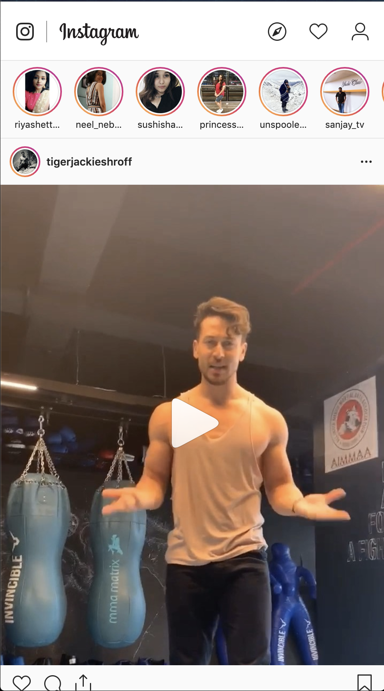
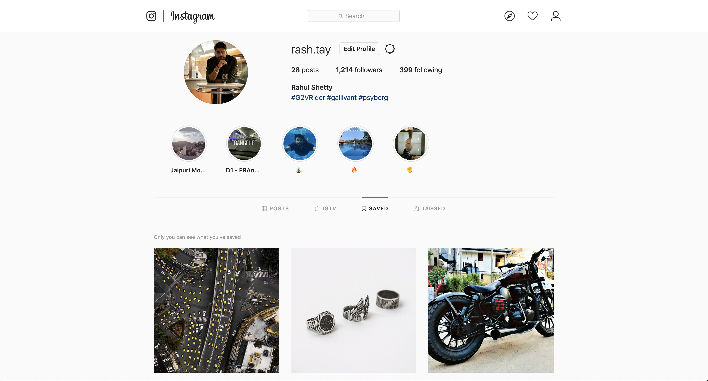
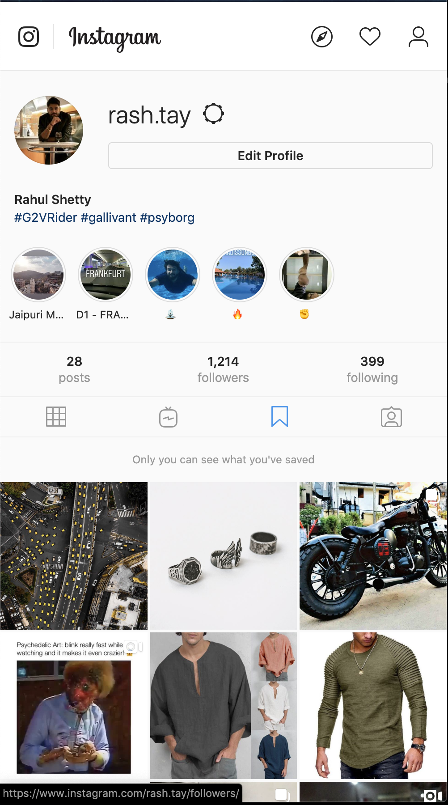

## Project Overview
As the title suggests, you'd have to create a responsive clone of the Instagram Landing Page and the profile using vanilla JavaScript and a couple of other useful library i.e lodash and moment.js. Instagram is a social media site where users can share their photos. While building this project you'll learn,

- **Landing Page**
	- Make API to retrieve the posts.
	- How to list the photos received from the API call?
	- Rendering the meta information beneath the photo?
	- Rendering and opening Insta like stories.
	- Like/Unlike
	- Comment
	- Bookmark
	- Like/Unlike comment
	- Rendering formatted date stamp using moment
	- Infinite scroll
	- Implementing 2 column layout
	- Creating an image slider
	- Sliding the slider via finger swipe on phones
	- Deleting the post from the list
- **Profile Page**
	- Show user's profile image with meta section
	- Rendering settings modal
	- Rendering saved used user stories
	- Rendering tabs to change layout

## Readiness Checklist
- ES6 Concepts
- DOM Manipulation
- Fetch API
- Async/Await
- Variables and Data structures
- JS Events
- CSS Layout: Grid/Flexbox
- Responsive Web Design
- SASS

### Screen mock ups

Image of the Instagram landing page.

Image of the Mobile version of the Instagram landing page.

Image of the Instagram profile page.

Image of the Mobile version of Instagram landing page.

### Boiler plate
Please use the boilerplate available in the [link](week_2/insta_clone). Details about starting and building the projects have been provided in the repo.

### Assets
Use [Fontawesome](https://fontawesome.com/icons) to search and pick icons. Basic usage of fontawesome can be learnt by going through this [link](https://fontawesome.com/how-to-use/on-the-web/referencing-icons/basic-use).

You do not have to configure anything to start using fontawesome. Everything has been preconfigured. Google fonts Lato and Raleway has been configured to be used too.

### User stories
##### Task 1
Write the HTML structure for both the pages.

##### Task 2
Use fontawesome for Instagram logo and add an hover animation on the logo.

##### Task 3
Style the header to match exactly like the Instagram site

##### Task 4
Render 2 column layout for rendering posts and stories

##### Task 5
In industries, JS devs have to read about the social media API documentation to integrate their API. We can provide you the steps to retrieve user posts and profile details. But, we would like you to go through the Instagram API documentation and figure out how to use their endpoints. Some helpful links

- https://www.instagram.com/developer/
- https://www.instagram.com/developer/endpoints/

Look at instagram landing page. You need to retrieve users feeds and users profile data from the API. Figure which endpoints would you use to achieve the same.

List the posts with the retrieved JSON response consisting of post details with the meta information and necessary icons like heart, comment, share and bookmark as seen on the site.

Create an image slider if there are multiple images.

##### Task 6
Show couple of comments on the posts, if there are any

##### Task 7
If the user deletes the post, it should disappear from the list.

##### Task 8
When all the posts from the first API request has been shown to the user and before the user scrolls to the bottom of the page, make a request to get the next set of posts from the API and appennd it to the bottom of the existing list.

This feature is called infinite scrolling. It's another form of pagination where a user doesn't have to wait to see the next set of data

##### Task 9
Render the list of dummy user stories with an Image and description.

The story should open exactly as shown on the Instagram website and should keep changing after a set duration.

When you list the stories, it should be clearly as to which stories have been read and which aren't.

##### Task 10
Allow the user to like, share (via email), comment and bookmark the post. All the data should persist on page refresh. Meaning a post that has been liked or bookmarked, should remain liked or bookmarked when the post is shown after a page refresh.

##### Task 11
Take the user to the profile section on clicking the profile. Please note that to make it a bit interesting, try opening the section on the same page without traversing to a new url i.e you . should render the profile page by replacing the current landing page and with profile page.

There should be a screen transition animation while navigating from landing page to profile page.

##### Task 12
Style and set the layout the profile page has shown in the image.

##### Task 13
Render tabs as seen on the Instagram page. You can eliminate/get rid of the 'IGTV' and 'Tagged' tab. On clicking the tab, respective tab content should load.

- **Posts** - will show user posts
- **Saved** - Show bookmarked images from the landing page

##### Task 14
Allow users to open posts on the profile page in a modal. Try clicking on one of the posts to see what's a modal.

You have to replicate the same modal

##### Task 15
Allow users to **like** the post on double tab and **bookmark** on pressing Ctrl + B on Windows and Cmd + B on Mac.

##### Task 16
Render and style the footer

##### Task 17
Make the application responsive

#### Task 18
Handle edge and error cases. For example, decide what should the user see when the APi fails to provide a response or show some message when the posts or comments aren't available. You can use creativity to handle it.
